# VPC Architecture

#### What is a VPC?

- A VPC is a virtual private cloud.
-  an on-demand configurable pool of shared resources allocated within a public cloud environment, providing a certain level of isolation between the different organizations using the resources.

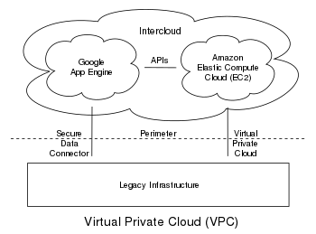

#### Benefits of VPC

1. Security
2. App performance
3. Compliance
4. Customization 
5. Hybrid Deployments
6. Bandwidth Efficiency

#### VPC internet gateway

- An internet gateway is a horizontally scaled, redundant, and highly available VPC component that allows communication between your VPC and the internet.

- It supports IPv4 and IPv6 traffic. It does not cause availability risks or bandwidth constraints on your network traffic.

- An internet gateway enables you to connect to an EC2 instance in AWS using your local computer.

#### Subnet

A subnet, or subnetwork, is a network inside a network. Subnets make networks more efficient. Through subnetting, network traffic can travel a shorter distance without passing through unnecessary routers to reach its destination.

#### What is CIDR?

- Classless Inter-Domain Routing or supernetting

- Is a method of assigning IP addresses that improves the efficiency of address distribution and replaces the previous system based on Class A, Class B and Class C networks.

- The initial goal of CIDR was to slow the increase of routing tables on routers across the internet and decrease the rapid exhaustion of IPv4 addresses. As a result, the number of available internet addresses has greatly increased.

#### What is Route table

A route table contains a set of rules, called routes, that determine where network traffic from your subnet or gateway is directed.

### Creating a VCP

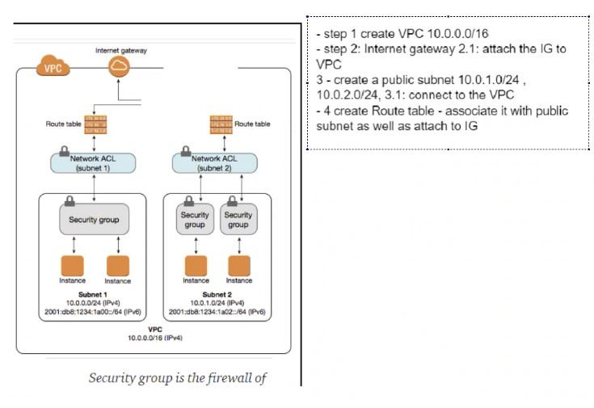

1. Navigate the AWS search bar for VCP, select this service. Then click `Create VCP`.

<br>

2. We need to complete the settings as follows:

- `VCP Only`

- Namin convention - `<your_name>-tech221-vcp`

- IPv4 CIDR set to `10.0.0.0/16`

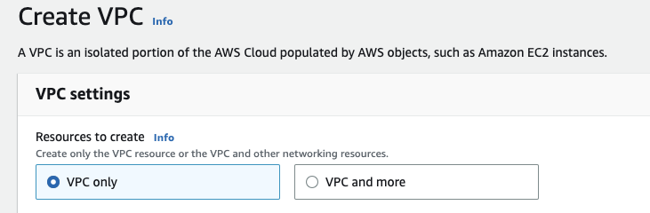

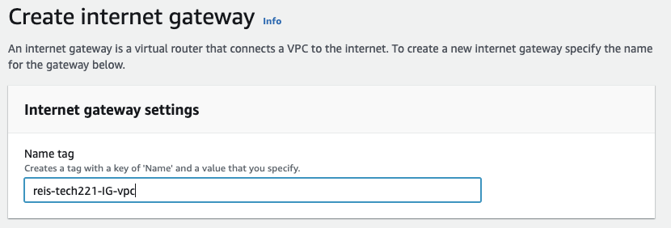

### Create Internet Gateway (IG)

1. On the left hand side panel search for Internet gateaway, In the new window click on `Create internet gateaway`
<br>

2. Add the same naming convention for the VCP, Then create it.
<br>

3. On the internet gateway `Actions`, choose to `attach to VCP`

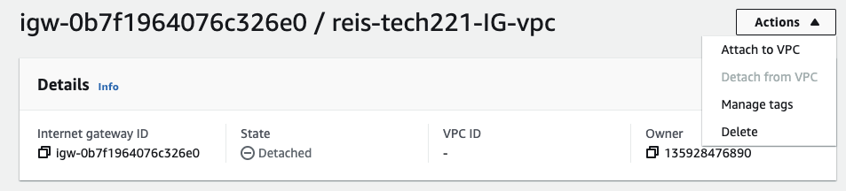

Choose the VCP you created, then attach it.

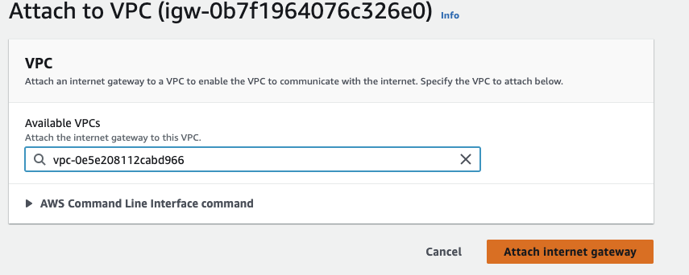

### Create Route Table 

1. On the left hand side panel search for route tables, In the new window click on `Create route tables`
<br>

2. Again use the same naming convention but this time add that this is a PUBLIC route table, and choose your VCP.

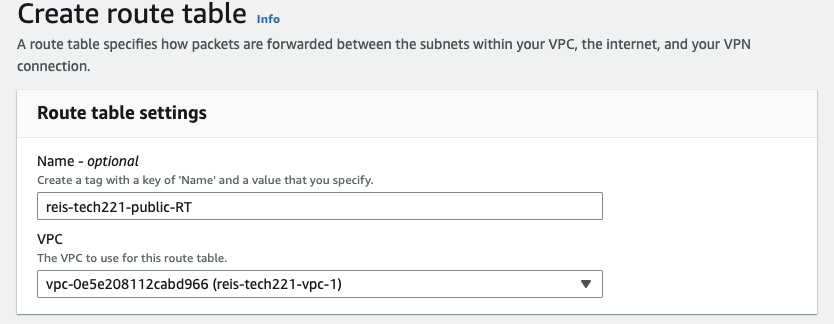

3. Go to Edit routes, add `0.0.0.0` to tje destination and your VCP for the target, save changes in order to allow public access

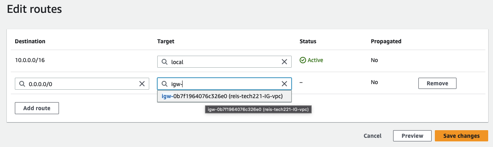

### Create Subnet

1. On the left hand side panel search for Subnet, In the new window click on `Create Subnet`
<br>

2. Follow same naming convention and search for your VCP, type in your `IPv4 CIDR block` anf then click on `Create subnet`.

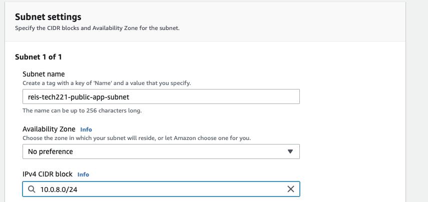

3. Go to your subnet and click on `Route table` at the bottom, click `edit route table association` add your public route table and `save`.

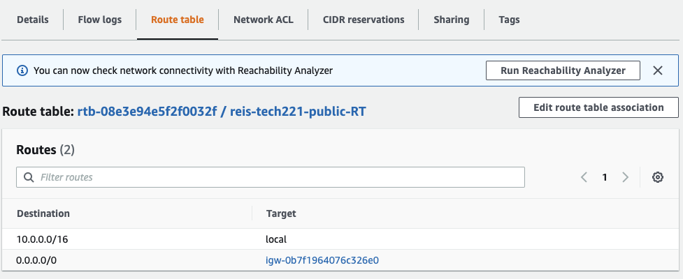

# Launch Nodejs app and MongoDB on our VCP

1. Create AMI's for both the app and db instances. 
<br>

2. Launch an EC2 instance of our app AMI but some changes to the settings must be made:

- Select your VCP
- Select your public Subnet

In Network Settings:
- Enable Auto-assign Public IP
- Add SSH connection to "My IP"
- Add HTTP connection to "Anywhere"
- Add Custom TCP Port 3000 connection to "Anywhere"

3. We Need to follow the steps to make a new Subnet but this time we make it `Private`, Within these settings we do the same but we make 

- IPv4 CIDR block - `Private IPv4 CIDR block`

4. We then need to make a private route table, following the same steps as before but this time we ammend the name to include private. 
<br>

5. Once the route table is created we need to navigate to `subnet association`, `edit subnet association` and select our private subnet. 

6. We now need to launch our DB AMI, again with different configeration settings:

- Select your VCP
- Select your private Subnet

In Network Settings:
- Disable Auto-assign Public IP
- Add SSH connection to "My IP"
- Add Custom TCP Port 27017 connection to "Anywhere"

7. The second to last stage is to connect our app to our db.

- SSH into our app instance (Changing root to ubuntu).

- Access the environment variables with:
```
sudo nano .bashrc
```
Ammend the environment variable `DB_HOST` to include the private IP assigned to the db instance. Save these changes with:
```
source .bashrc
```

- We can now cd into our app and start it with:

```
cd app

node app.js 
```

8. Use our public IP address assigned to our App instance to navigate to it on our browser with `/posts` at the end.

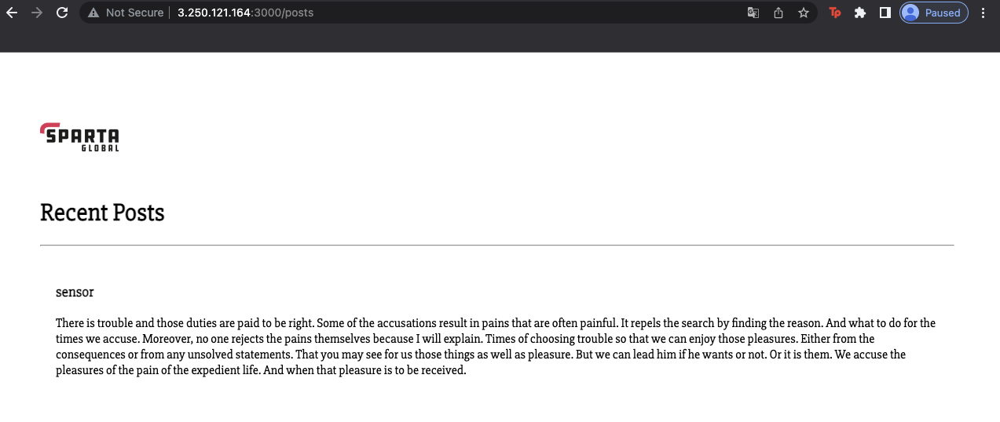
